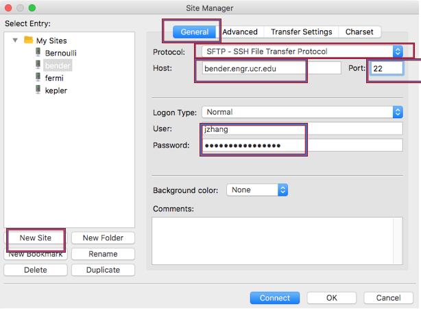
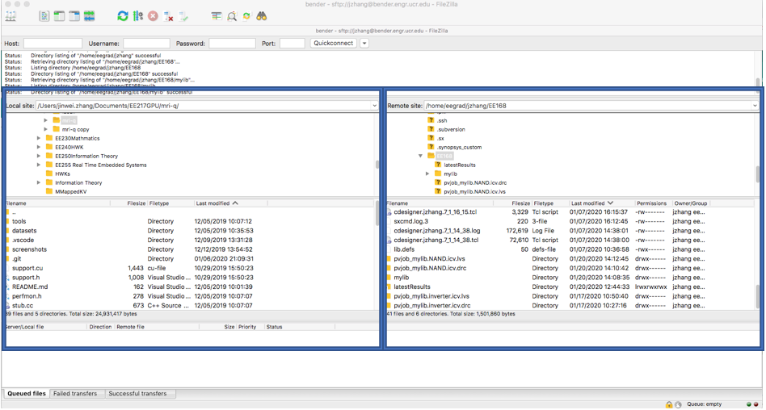

# Tutorial
Transfer files between server and your local computer.

1. Download Filezilla from online as free tool. link as below.
https://filezilla-project.org/ to download Filezilla client.

2. After install, click 'File' -> 'Site Manager', on the right-hand side, click 'New Site'. And then click 'General' to create a new site. Setup as following:

_**Fig. 1 Set up host site**_

3. Then click 'Connect'. As showed in the screenshot below, the left section shows your local directory, and the right section shows your remote directory on the server. Choose your proper folder, you can drag or right click to move your files between the server and your local host. 

_**Fig. 2 Filezilla home**_
